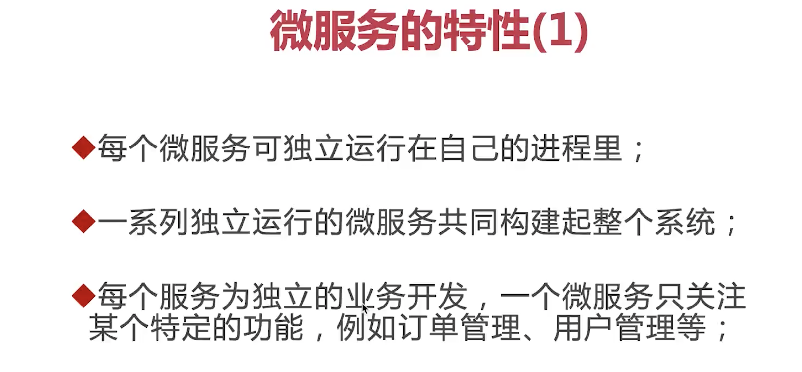
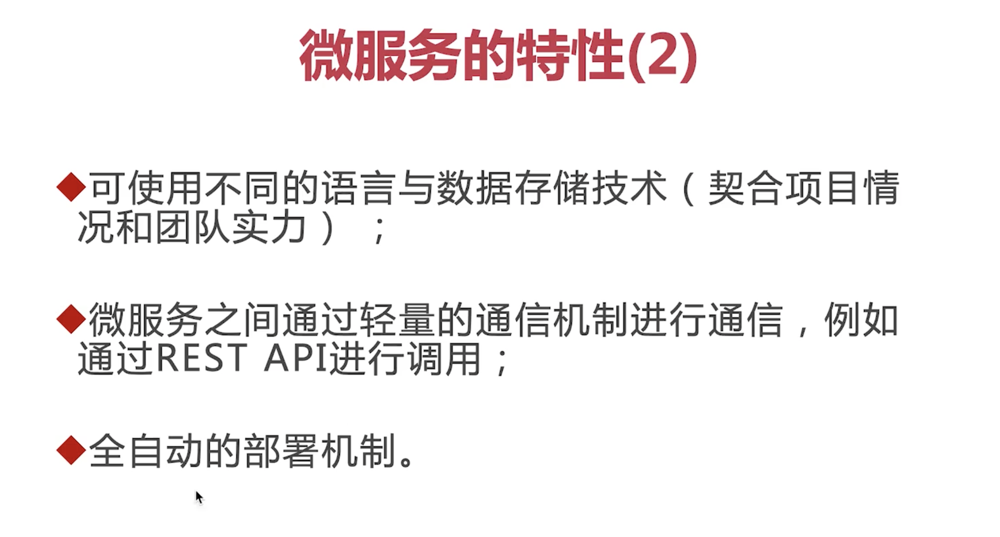
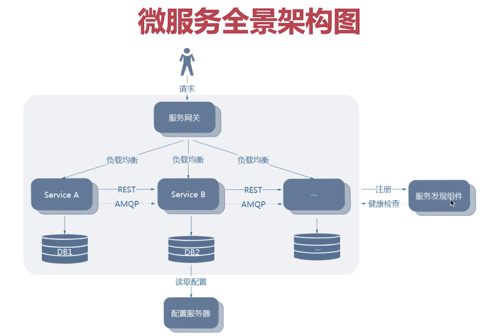
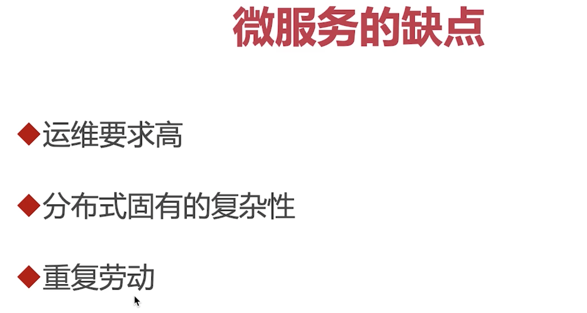
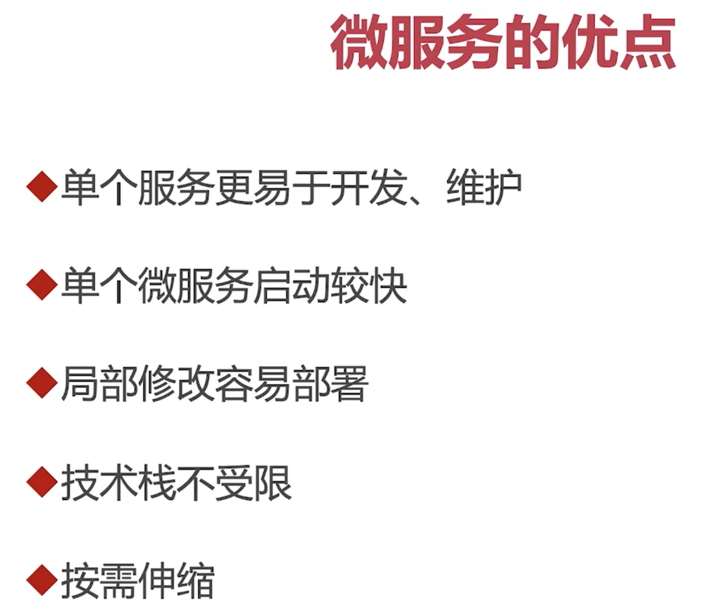
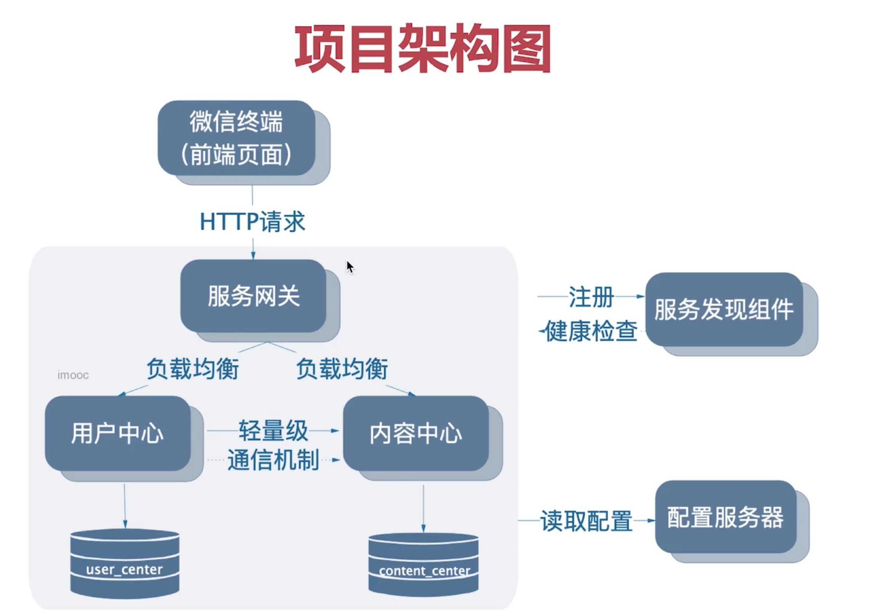

# 微服务特性

  

  


微服务全景架构图

  


微服务的优缺点：

缺点：
  
其中所谓的重复性劳动指在不同微服务中有可能用到相同的功能，由于微服务有可能使用不同的框架语言开发，所以单纯的封装相同的类是不行的。

优点：



# 微服务拆分

方法论：
```
目前主要有两种： DDD(Domain Driven Design)和OOP（Object oriented programming)

1. 职责划分（订单微服务只关注订单相关的业务）
2. 通用型划分（把通用功能做成微服务-用户中心，消息中心）

```

微服务粒度:

如何去拆分得到一个合理的粒度？

1. 良好的满足业务
2. 团队中无人认为微服务太大，或者难以CICD
3. 增量迭代--微服务之间相互独立，一次迭代中只需要迭代部分微服务就行
4. 持续净化--如果相对微服务进行重构，重新的技术选型，这不应该是难以完成的
5. 对于很大的微服务，可以进行拆分
6. 对于粒度过细的微服务，可以进行整合


# 项目的架构图

  