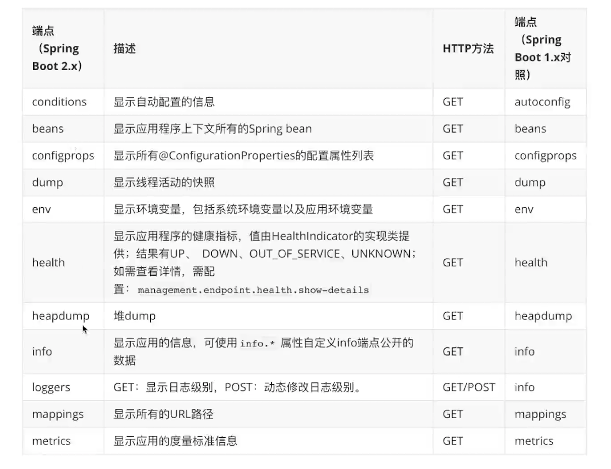
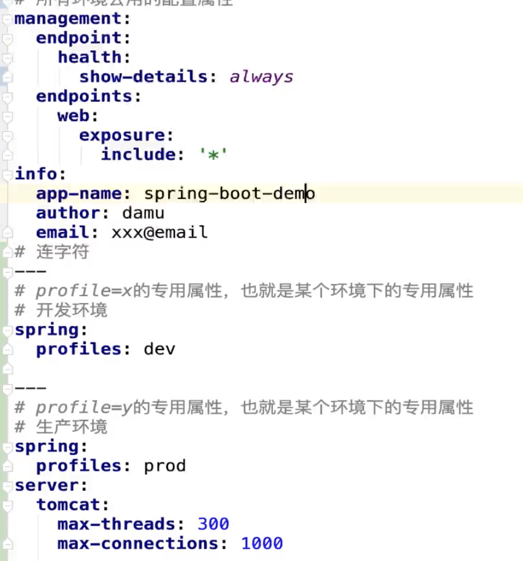

# Spring actuator

使用actuator首先需要添加以来依赖:
``` xml
<dependency>
   <groupId>org.springframework.boot</groupId>
   <artifactId>spring-boot-starter-actuator</artifactId>
</dependency>
```

访问localhost:8080/actuator可以查看所有监控资源链接

## 配置application.properties
```
激活所有actuator端点
management.endpoints.web.exposure.include=*

激活指定端点
1. health端点
检查应用的健康状态
management.endpoint.health.show-details=always 
2. info端点
可以配置显示一些应用的信息
info.app-name=spring-boot-demo
info.author=demo
info.email=520156723@qq.com
```

更多的配置: 

https://docs.spring.io/spring-boot/docs/2.6.3/reference/htmlsingle/#application-properties.actuator

还有更多的端点可以暴露出来:

  


# 配置

在springboot中有几种配置app的方式

1. 配置文件

    使用application.properties或者application.yml来进行配置

    为什么更偏向使用yml格式的文件？

    1. 可读性更强，特别是数量多
    2. 容器界更受欢迎
    3. 可以保证配置的读取顺序
2. 环境变量
3. 外部配置文件
4. 命令行参数

## Profile

在不同的环境下使用不同的profile来使用不同的配置

在yml配置文件中使用profile
   

在properties文件中使用profile

创建多个properties文件，e.g.
```
application.properties

application-dev.properties

application-prod.properties
```

最佳实践：

1. 避免冲突-配置不要同时出现在两个文件
2. 规划好配置属性的位置-公用或者专用的profile，事先规划好
